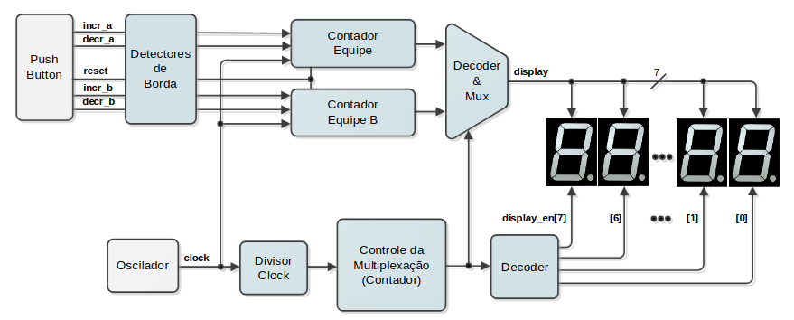

# Trabalhos da disciplina de Construção de Sistemas Digitais

- Os trabalhos foram feitos com a linguagem de descrição de hardware System Verilog em conjunto com EDAs como Vivado e Modelsim, e implementados na placa Nexys-A7.

# Laboratorio 1 - Contador/Placar eletrônico 

- Circuito lógico sequencial, em SystemVerilog, que implementa um placar eletrônico digital cujos dados são apresentados nos quatro displays de 7-segmentos do kit de desenvolvimento de forma multiplexada.

